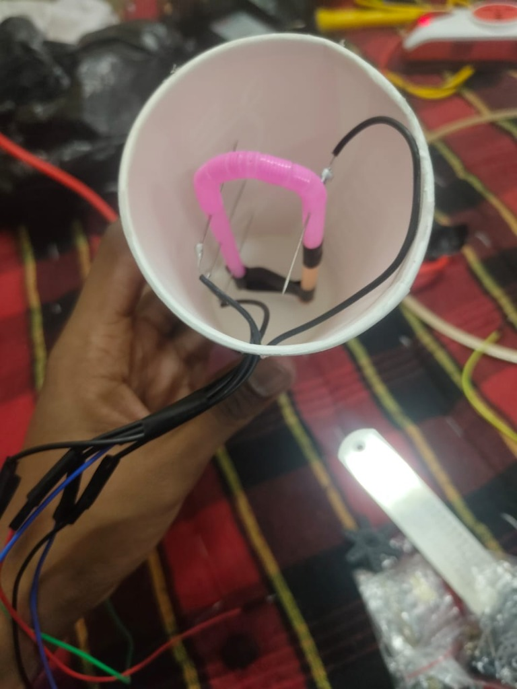
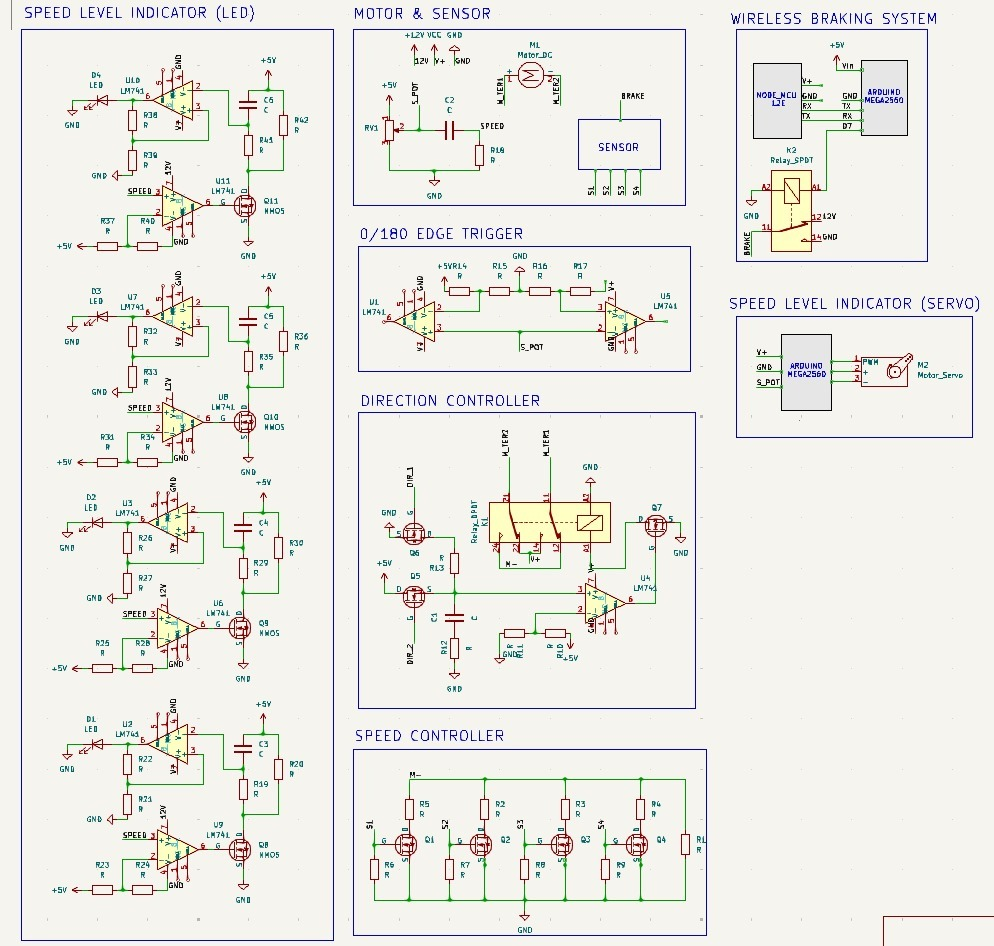

# 🌧️ RainRainGoAway

> **An intelligent rain-adaptive vehicle system** — automatic wiper speed control, speed-level indication, and wireless emergency braking, built for the **Kriti** robotics competition.

---

## 📖 Overview

RainRainGoAway is an embedded systems project that detects **rainfall intensity** using a custom-built sensor and automatically adjusts vehicle systems in response. The project combines analog signal processing, microcontroller firmware, and IoT connectivity into a cohesive safety system.

### Key Features

- 🌧️ **Custom Rain Sensor** — A hand-made U-tube manometer that distinguishes 4 levels of rainfall intensity
- 🔄 **Adaptive Wiper Control** — Servo-driven wiper adjusts speed based on detected rain level
- 💡 **Speed Level Indicator** — LED array and servo gauge display the current vehicle speed
- 🛑 **Wireless Emergency Braking** — Remote brake activation via smartphone using Blynk IoT
- ⚡ **Analog Signal Processing** — RC differentiator circuit for real-time speed detection from a potentiometer

---

## 🌧️ Rain Sensor

<p align="center">
  
  <br/>
  <em>Custom U-tube rain sensor with funnel collector and 4-level electrodes</em>
</p>

Our rain sensor is a **hand-made U-shaped tube** with a funnel on one side to collect water from a larger area and channel it into a smaller cross-section.

### How It Works

1. **Collection** — The funnel captures rainwater and directs it into one arm of the U-tube
2. **Level Detection** — As rainfall intensity increases, water rises through 4 distinct electrode levels on the opposite arm
3. **Circuit Activation** — A battery is connected at the base; when water reaches each level, it completes the circuit, sending a signal corresponding to that rain intensity
4. **Self-Draining** — A small hole at the lowest point allows water to drain out continuously

### Why This Design Works

The system leverages **Torricelli's theorem** (velocity of efflux): as water height increases in the U-tube, the outflow rate through the drain hole also increases proportionally. This creates a **dynamic equilibrium** — at a constant rainfall rate, water stabilizes at a specific level without overflowing to the next. This elegantly maps each steady-state rain intensity to exactly one of the 4 sensor levels.

| Sensor Level | Rain Intensity | Response           |
| ------------ | -------------- | ------------------ |
| Level 0      | No rain        | Wipers off         |
| Level 1      | Light drizzle  | Slow wiper speed   |
| Level 2      | Moderate rain  | Medium wiper speed |
| Level 3      | Heavy rain     | Fast wiper speed   |
| Level 4      | Downpour       | Maximum wiper speed|

---

## ⚡ Circuit Design

<p align="center">
  
  <br/>
  <em>Complete system schematic (KiCad) — click to enlarge</em>
</p>

The system is composed of several interconnected subsystems:

### Subsystem Architecture

```
┌──────────────┐     ┌───────────────────┐     ┌──────────────────┐
│  Rain Sensor │────▶│  Speed Controller │────▶│   DC Motor       │
│  (U-tube)    │     │  (4x NMOS + R)    │     │   (12V)          │
└──────────────┘     └───────────────────┘     └──────────────────┘
                              │
                              ▼
                     ┌───────────────────┐
                     │  Potentiometer    │──── Triangular Wave Output
                     │  (Speed Feedback) │
                     └───────────────────┘
                              │
                    ┌─────────┴─────────┐
                    ▼                   ▼
          ┌──────────────┐    ┌──────────────────┐
          │ RC Differ-   │    │ 0/180 Edge       │
          │ entiator     │    │ Trigger           │
          └──────┬───────┘    └──────────────────┘
                 │
          ┌──────┴───────┐
          │  LM741 Op-   │
          │  Amp Array   │
          └──────┬───────┘
                 │
        ┌────────┴────────┐
        ▼                 ▼
┌──────────────┐  ┌──────────────┐
│ Speed Level  │  │ Speed Level  │
│ Indicator    │  │ Indicator    │
│ (4x LEDs)   │  │ (Servo)      │
└──────────────┘  └──────────────┘

┌───────────────────────────────────┐
│     Wireless Braking System       │
│  NodeMCU ──serial──▶ Arduino     │
│  (Blynk)            (Relay+Brake)│
└───────────────────────────────────┘

┌───────────────────────────────────┐
│     Direction Controller          │
│  DPDT Relay + Op-Amp Comparator   │
│  (Forward / Reverse)              │
└───────────────────────────────────┘
```

### Key Components

| Component            | Part             | Role                                           |
| -------------------- | ---------------- | ---------------------------------------------- |
| Op-Amp               | LM741 (×6)      | Comparators for speed level thresholds          |
| Power MOSFETs        | NMOS (×4)       | Switch motor speed stages                       |
| Microcontroller      | Arduino Mega2560 | Servo control + brake relay actuation           |
| WiFi Module          | NodeMCU ESP8266  | Blynk IoT connectivity for wireless braking     |
| Servo                | Standard servo   | Wiper motor / speed gauge needle                |
| Relay                | SPDT + DPDT      | Brake actuation + motor direction reversal      |

---

## 📐 Speed Detection Theory

<p align="center">
  
  <br/>
  <em>RC differentiator theory — Vout is proportional to the rate of change of Vin</em>
</p>

The vehicle speed is inferred by analyzing the **triangular wave** produced by a potentiometer mechanically coupled to a rotating part. An **RC differentiator** circuit extracts the slope:

```
Vin (potentiometer) ──┤├──┬── Vout
                       C   R
                           │
                          GND
```

**Mathematical basis:**

$$V_{out} = RC \cdot \frac{dV_{in}}{dt} \cdot e^{t/RC} + K$$

For practical purposes:

$$V_{out} \propto \frac{dV_{in}}{dt}$$

Higher speed → higher frequency triangular wave → steeper slope → larger Vout. The op-amp comparator array then classifies the signal into discrete speed levels by comparing against threshold voltages.

### Digital Approximation (in firmware)

The `ServoMovingTriangle.ino` sketch implements this digitally:

```
currentDiff = Σ|sample[i+1] - sample[i]| / 98
```

| `currentDiff` | Speed Level | Servo Angle |
| ------------- | ----------- | ----------- |
| < 1.5         | 0 (stopped) | 180°        |
| < 4.5         | 1 (slow)    | 140°        |
| < 6.0         | 2 (medium)  | 100°        |
| < 8.2         | 3 (fast)    | 60°         |
| ≥ 8.2         | 4 (v. fast) | 20°         |

---

## 🛑 Wireless Braking System

A two-board architecture provides **remote emergency braking** via a smartphone:

```
┌────────────┐   WiFi    ┌────────────┐  Serial   ┌─────────────┐  Relay  ┌───────┐
│  Blynk App │ ────────▶ │  NodeMCU   │ ────────▶ │ Arduino Mega│ ──────▶ │ Brake │
│ (Phone)    │           │  ESP8266   │           │             │         │       │
└────────────┘           └────────────┘           └─────────────┘         └───────┘
```

1. **User presses** the brake button on the Blynk app (virtual pin V1)
2. **NodeMCU** receives the event over WiFi and sends `"1"` via serial TX
3. **Arduino** reads `"49"` (ASCII for `'1'`), drives pin 7 HIGH
4. **SPDT relay** activates, engaging the braking mechanism

---

## 📁 Project Structure

```
RainRainGoAway/
├── README.md                              # This file
├── Kriti_WirelessBraking_Arduino.ino      # Arduino: serial brake receiver
├── kriti_WirelessBraking_nodemcu.ino      # NodeMCU: Blynk → serial transmitter
├── ServoMovingTriangle.ino                # Arduino: speed detection → servo control
├── kriti.kicad_sch                        # Full circuit schematic (KiCad)
└── images/
    ├── rain_sensor.jpg                    # Photo of the U-tube rain sensor
    ├── circuit_schematic.jpg              # Screenshot of the KiCad schematic
    └── theory_notes.jpg                   # Handwritten RC differentiator derivation
```

---

## 🛠️ Hardware Requirements

- Arduino Mega 2560
- NodeMCU ESP8266
- LM741 Op-Amps (×6)
- N-channel MOSFETs (×4)
- Standard servo motor
- SPDT relay (braking) + DPDT relay (direction)
- 12V DC motor
- Potentiometer (speed feedback)
- LEDs (×4, speed indicators)
- Custom U-tube rain sensor with funnel
- Resistors, capacitors (as per schematic)
- 12V + 5V power supply

## 💻 Software Dependencies

- [Arduino IDE](https://www.arduino.cc/en/software)
- [ESP8266 Board Package](https://github.com/esp8266/Arduino)
- [Blynk Library](https://github.com/blynkkk/blynk-library)
- [Servo Library](https://www.arduino.cc/reference/en/libraries/servo/) (built-in)
- [KiCad](https://www.kicad.org/) (for viewing/editing the schematic)

## 📲 Blynk Setup

1. Create a new project on [Blynk IoT](https://blynk.io/)
2. Add a **Button** widget mapped to virtual pin **V1**
3. Update the credentials in `kriti_WirelessBraking_nodemcu.ino`:
   ```cpp
   #define BLYNK_TEMPLATE_ID "YOUR_TEMPLATE_ID"
   #define BLYNK_TEMPLATE_NAME "YOUR_TEMPLATE_NAME"
   #define BLYNK_AUTH_TOKEN "YOUR_AUTH_TOKEN"
   char ssid[] = "YOUR_WIFI_SSID";
   char pass[] = "YOUR_WIFI_PASSWORD";
   ```

---

## 🏆 Built For

**Kriti** — IIT Kanpur's annual technical festival robotics competition.

---

## 📄 License

This project is open-source. Feel free to use, modify, and distribute.
